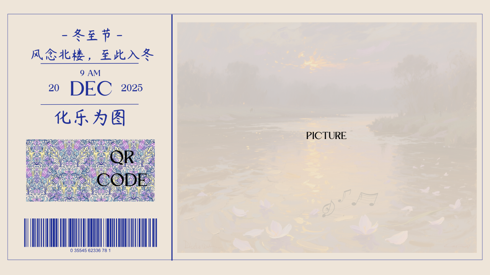

# midi2image (Winter Solstice Web Demo)

A browser-based MIDI booth app:
- Plug in a MIDI keyboard, play in the browser with piano sound + visuals
- Record → generate a low-res timeline color-block image (4:3) + prompt
- Call DashScope `qwen-image-plus` to generate the final AI image (default 4:3)
- Generate a share card based on `assets/template.png` (AI image + QR), then scan to download

## Run (Web App)

```bash
python web_app.py
# visit http://localhost:8012
```

Recommended browser: Chrome / Edge (Web MIDI required).

## No Domain? Use HTTPS Forwarding (Web MIDI on Public IP)

Web MIDI is blocked on plain HTTP for public IPs. If you don’t have a domain/certificate yet, you can forward your server’s `http://127.0.0.1:8012` to a public **HTTPS** URL using Cloudflare Quick Tunnel:

```bash
./scripts/cloudflare_https_forward.sh
```

It prints a `https://xxxx.trycloudflare.com` URL. Open that URL in Chrome/Edge to use MIDI.

## Template Share Card (`assets/template.png`)

The server renders a final share card image using `assets/template.png`:
- AI image is placed into rectangle `(x1,y1,x2,y2) = (463,58,1245,661)`
- QR code (links to a download page with MP3/timeline/AI image) is placed into `(236,364,404,527)`

The rendered share card is saved under `data/output/cards/` and the web page shows a QR code that downloads this card image.

Preview:



## Quick Start

### 1) Local MIDI Visualization
```bash
# Convert a MIDI file to image
python midi_to_image.py data/files/your.mid

# With custom pixels per second
python midi_to_image.py data/files/your.mid --pps 100
```

### 2) AI Image Generation (Requires API Key)
```bash
# Generate image from an existing prompt txt file
python run.py data/prompts/your.txt

# Optional: choose size (default: 1472*1140, 4:3)
python run.py data/prompts/your.txt --size 1328*1328
```

## API Key Setup

The image generation feature requires an Alibaba Cloud DashScope API key:

### Option 1: Get a Free API Key
1. Visit https://dashscope.aliyun.com/
2. Sign up for an account
3. Navigate to API Key management
4. Create a new API key with access to image generation models (e.g. `qwen-image-plus`)

### Option 2: Configure the API Key

**Method A: Environment Variable (Recommended)**
```bash
# Windows (Command Prompt)
set DASHSCOPE_API_KEY=your-api-key-here

# Windows (PowerShell)
$env:DASHSCOPE_API_KEY="your-api-key-here"

# Linux/Mac
export DASHSCOPE_API_KEY="your-api-key-here"
```

**Method B: Configuration File**
Create `.dashscope_config.json` in the project root:
```json
{
  "api_key": "your-api-key-here"
}
```

## Project Structure

```text
.
├── assets/
│   └── template.png
├── web/
│   ├── index.html
│   └── qrcode.min.js
├── data/                 (runtime, ignored by git)
│   ├── files/
│   ├── output/
│   │   └── cards/
│   ├── prompts/
│   └── image/
├── web_app.py
├── midi_to_image.py
├── midi_to_prompt.py
└── run.py
```

Key files:
- `web_app.py` - Web server + JSON APIs (default port 8012)
- `web/index.html` - Frontend UI (stage flow + share QR)
- `run.py` - DashScope `qwen-image-plus` client
- `midi_to_image.py` - MIDI → low-res timeline image (4:3)
- `midi_to_prompt.py` - MIDI → prompt (sanitized to reduce API filter issues)
- `assets/template.png` - Share card template

Runtime data (ignored by git):
- `data/files/` - Recorded MIDI + uploaded MP3
- `data/output/` - Timeline images + share cards
- `data/prompts/` - Prompt txt files
- `data/image/` - AI generated images

## Troubleshooting

### "Access denied" (403) Error
This means your API key is invalid, expired, or doesn't have permission:
1. Check your API key at https://dashscope.aliyuncs.com/console
2. Ensure you have sufficient quota/balance
3. Ensure the API key has access to `qwen-image-plus` (image generation)

### No API Key Available?
Use the local MIDI visualization instead:
```bash
python midi_to_image.py your_midi_file.mid
```

### Network Issues
- Check your internet connection
- Ensure you can access https://dashscope.aliyuncs.com

## Dependencies

Install required packages:
```bash
pip install mido pillow requests
```

For Windows MIDI support, you may also need:
```bash
pip install python-rtmidi
```

## License

MIT License
